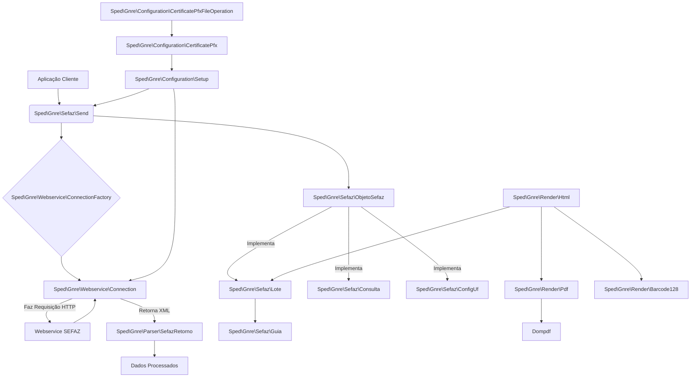

# Guia de Pesquisa e Arquitetura do Projeto SPED-GNRE

Este documento visa auxiliar na pesquisa de documentação oficial da GNRE e apresentar uma visão arquitetural do projeto `sped-gnre`.

## 1. Pesquisa de Documentação Oficial da GNRE

A Guia Nacional de Recolhimento de Tributos Estaduais (GNRE) é um documento complexo, com regulamentações que podem variar por estado e são frequentemente atualizadas. A pesquisa contínua é essencial para garantir a conformidade.

### Fontes Oficiais de Informação:

1.  **Portal Nacional da GNRE:**
    *   Este é o ponto de partida principal para manuais de integração, notas técnicas e legislação geral.
    *   **Link:** [http://www.gnre.pe.gov.br/gnre/portal/](http://www.gnre.pe.gov.br/gnre/portal/)
    *   Procure por seções como "Manuais", "Notas Técnicas", "Legislação" e "FAQ".

2.  **Conselho Nacional de Política Fazendária (CONFAZ):**
    *   O CONFAZ é o órgão que delibera sobre políticas fiscais entre os estados. Atos COTEPE e Convênios ICMS são frequentemente publicados aqui e podem impactar a GNRE.
    *   **Link:** [https://www.confaz.fazenda.gov.br/](https://www.confaz.fazenda.gov.br/)
    *   Explore as seções de "Convênios", "Ajustes SINIEF" e "Atos COTEPE".

3.  **Secretarias de Fazenda (SEFAZ) Estaduais:**
    *   Cada estado pode ter particularidades na implementação da GNRE, incluindo URLs de webservices, regras de validação específicas e procedimentos para credenciamento de certificados.
    *   **Como pesquisar:** Acesse o site oficial da SEFAZ do estado de interesse (ex: `sefaz.pr.gov.br`, `sefaz.sp.gov.br`). Procure por seções relacionadas a "GNRE", "Documentos Fiscais Eletrônicos", "Webservices" ou "Desenvolvedores".
    *   **Dica:** Utilize motores de busca com termos como "GNRE [Nome do Estado] SEFAZ" ou "Webservice GNRE [Nome do Estado]".

4.  **Receita Federal do Brasil:**
    *   Embora a GNRE seja um tributo estadual, a Receita Federal pode ter informações complementares ou legislação que indiretamente afete a GNRE, especialmente em relação a cadastros (CNPJ, CPF).
    *   **Link:** [https://www.gov.br/receita/pt-br](https://www.gov.br/receita/pt-br)

### Dicas para Pesquisa Efetiva:

*   **Versões:** Sempre verifique a versão dos manuais e notas técnicas. A GNRE possui versões (ex: 1.00, 2.00) que introduzem mudanças significativas.
*   **Datas de Publicação:** Atente-se às datas de publicação e vigência da legislação e notas técnicas.
*   **Termos de Busca:** Use termos específicos como "Manual de Orientação do Contribuinte GNRE", "Nota Técnica GNRE", "Schema XSD GNRE", "Webservice GNRE Homologação/Produção".
*   **Fóruns e Comunidades:** Fóruns de desenvolvedores e comunidades especializadas em SPED/NF-e/GNRE (como o antigo grupo `gnrephp` no Google Groups) podem ser úteis para entender problemas comuns e soluções práticas, mas sempre valide as informações com as fontes oficiais.

## 2. Arquitetura do Projeto `sped-gnre`

O projeto `sped-gnre` é estruturado em módulos que encapsulam diferentes responsabilidades, facilitando a comunicação com os webservices da SEFAZ e o tratamento dos dados da GNRE.

### Explicação dos Componentes Principais:

*   **`Sped\Gnre\Sefaz\Send`**: O orquestrador principal para enviar requisições à SEFAZ. Ele utiliza um `ConnectionFactory` para obter uma `Connection` e um `ObjetoSefaz` para preparar os dados.
*   **`Sped\Gnre\Webservice\ConnectionFactory`**: Responsável por criar instâncias de `Connection`.
*   **`Sped\Gnre\Webservice\Connection`**: Lida com a comunicação HTTP real com os webservices da SEFAZ (usando cURL internamente).
*   **`Sped\Gnre\Sefaz\ObjetoSefaz`**: Uma interface (ou classe base abstrata) que define o contrato para objetos que representam requisições à SEFAZ.
    *   **`Sped\Gnre\Sefaz\Lote`**: Implementa `ObjetoSefaz` para envio de lotes de guias GNRE.
    *   **`Sped\Gnre\Sefaz\Consulta`**: Implementa `ObjetoSefaz` para consulta de status de lotes.
    *   **`Sped\Gnre\Sefaz\ConfigUf`**: Implementa `ObjetoSefaz` para consulta de configurações por UF.
*   **`Sped\Gnre\Sefaz\Guia`**: Representa uma única guia GNRE dentro de um lote.
*   **`Sped\Gnre\Parser\SefazRetorno`**: Responsável por analisar as respostas XML da SEFAZ.
*   **`Sped\Gnre\Configuration\Setup`**: Define as configurações gerais do ambiente (certificados, proxy, debug).
*   **`Sped\Gnre\Configuration\CertificatePfx`**: Lida com a extração de dados de certificados PFX.
*   **`Sped\Gnre\Configuration\CertificatePfxFileOperation`**: Auxilia na operação de arquivos de certificado.
*   **`Sped\Gnre\Render\Html`**: Gera a representação HTML da guia GNRE.
*   **`Sped\Gnre\Render\Pdf`**: Converte o HTML da guia em PDF (utiliza Dompdf).
*   **`Sped\Gnre\Render\Barcode128`**: Gera o código de barras da guia.

Esta arquitetura modular permite que diferentes partes do sistema sejam desenvolvidas e mantidas de forma independente, facilitando a adaptação a mudanças nas especificações da SEFAZ ou a adição de novas funcionalidades.
